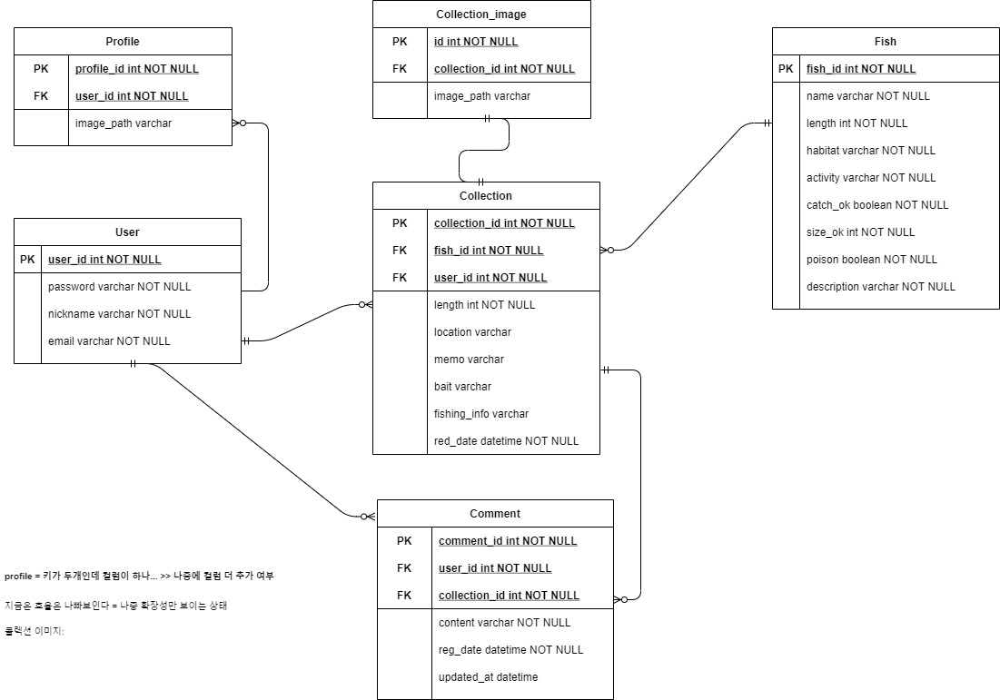

# [A202] 낚시도감 서비스

🐟🐟낚시해서 잡은 **물고기**를 **분류**하고 **저장**할 수 있는 서비스입니다🐟🐟

 

## 기능 소개

#### 🙋‍♀️회원관리🙋‍♀️

- 카카오톡을 이용한 소셜 로그인 (첫 로그인 시 서비스 회원정보에 저장)
- 회원정보 조회
- 회원정보 변경
- 회원 탈퇴

#### 🐠물고기 도감 관리🐠

- 내 보관함 (물고기 전체 조회)
- 도감 상세보기 (물고기 상세 조회)
- 물고기 등록 (사진 찍기)
- 물고기 분석 (AI 모델)
- 도감 정보 수정
- 도감 삭제

#### 🏆랭킹 시스템🏆

- 어종 크기별 유저 전체 랭킹 조회

#### 🗣도감 댓글🗣

- 도감에 댓글 작성, 조회, 수정, 삭제

 

## 21.03.22 ~ 21.03.26 개발 현황

- **AI 물고기 분석**
  - AI 모델 개발 완료. 정확도를 위한 모델 개선 중
  - AI 분석 서버에 모델 배포 완료
  - 안드로이드 카메라에서 사진 촬영 후 분석 서버에 이미 전달 과정 개발 중
- **물고기 도감**
  - 도감 CRUD 개발 진행 중
- **회원관리**
  - 카카오 소셜 로그인 학습 진행 중
- **랭킹 시스템**
  - 도감 정보 기반 랭킹 시스템 구축 완료
  - redis를 이용한 랭킹 시스템 개발 진행 중
- **도감 댓글**
  - 댓글 CRUD 개발 진행 중

[아키텍처](#아키텍처)

[시퀸스 다이어그램](#시퀀스-다이어그램)

​	[1.인증](#인증)

​	[2. 분석](#분석)

[ERD](#ERD)

[와이어프레임](#와이어프레임)

 

## 아키텍처

## 시퀸스 다이어그램

### 인증

### 분석

## ERD

- 자주 update이 되는 부분 세부 정규화

## 와이어프레임

- 회원가입 

  - 소셜 로그인 확정 : 카카오

  

- 로그인 

  - 소셜 로그인 대체 전 와이어프레임

  

- 회원 정보

  

- 물고기 보관함

  - 사진, 메모, 내용이 간략히 들어감

  

- 물고기 상세보기

  - User 입장

    

  - Others 입장 

    

- 카메라

  - 글을 등록하기 위한 사진 촬영 과정

  

- 물고기 등록

  - 글 작성 1

    

  - 글 작성 2

    

  - 글 작성 3

    

  - 글 작성 4

    

- 랭킹

  - Top 1-3, Top 4-50 가 보여짐

  

