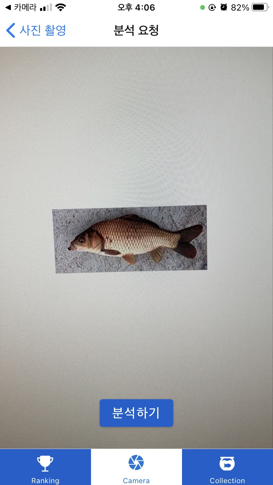

# [A202] 낚시도감 서비스

🐟🐟낚시해서 잡은 **물고기**를 **분류**하고 **저장**할 수 있는 서비스입니다🐟🐟

 

# ❗❗❗❗프로젝트 안내❗❗❗❗

해당 프로젝트는 어플 설치가 필수입니다. 로컬 환경에서는 일부 기능이 동작하지 않을 수 있으니 어플 설치 후 테스트 하는 것을 권장합니다.

 

## 프로그램 설치

### 안드로이드 

1. [피쉬포켓 앱 설치하기](https://drive.google.com/file/d/19zxCEvGPvqWgXtQ87xpkJ7eMqtfTkTM1/view?usp=sharing) 에 접속하여 fishapp_v1.0.4를 다운받습니다.
2. 다운받은 apk파일을 폰에서 설치합니다. 

### IOS

1. 개발자 계정이 없어 설치파일을 생성하지 못했습니다.  
2. 만약 확인하고 싶으시다면. 연락주십시오.

 

## ❗❗❗❗프로그램 사용 시, 주의사항❗❗❗❗

1. 사진을 찍을 경우,
   1.  가로로 찍어주세요
   2.  물고기가 사진의 80% 이상 차지하게 해주세요.
2. 모니터를 이용해서 물고기 사진을 찍을 경우, 모니터 노이즈로 인해 정확한 분석결과가 나오지 않습니다. 실물 물고기 찰영을 권장합니다
3. 저희는 세로모드만 지원합니다. 임의로 가로모드로 사용하지 마십시오. 

 

## 🛠️Install & Usage

다운 받은 apk 설치 시, 무시하고 설치하기를 터치하여 설치를 진행해주세요.

 

## ❗❗❗❗백엔드 안내❗❗❗❗

- **현재 프로젝트 내부의 모든 설정은 배포된 서버를 기준으로 작성되었습니다. **

### 로컬에서 프로젝트를 실행할 때 유의할 점

- deep_learning 폴더 내의 리드미를 통해 프로젝트에서 사용한 인공지능 모델 파일들을 다운받아주세요
- 레디스를 사용하는 프로젝트입니다. 로컬에서 실행하는 경우 설치 후 6379 포트 생성이 필수적입니다. 로컬에서 돌리는 경우 `RedisConfig`의 주석을 확인해주세요
- 모든 서비스에는 `user_token`이 필요합니다. 토큰 발급은 어플 실행을 통해 로그를 확인하여 사용할 수 있습니다. 
- 물고기 등록시,  도커 상의 경로로 되어있어서 로컬에서는 이미지 업로드가 불가능합니다.

 

[TOC]

## 어플 사용 방법

### 랭킹

어플 실행 후 나오는 첫 화면으로 Top3 랭커의 경우 프로필과 함께 상단에 고정 표시되며 나머지 인원들은 스크롤 뷰를 통해 닉네임과 기록이 표시됩니다.

랭킹 유저를 터치하면 해당 유저가 잡은 물고기 상세 정보를 확인할 수 있습니다.

### 카메라 분석

카메라 분석 기능을 위해서는 카카오 로그인이 필요합니다.

로그인 후, 잡은 물고기를 촬영할 수 있습니다.

촬영 후 사진 결과를 보고 분석을 요청합니다.

서버와 통신하여 분석 결과를 받아올 수 있습니다.

저장하기를 통해 세부 내용을 입력하고 도감에 저장할 수 있습니다.

저장된 물고기는 나의 도감 스크린에서 확인할 수 있습니다.

### 콜렉션

개인 도감 기능을 사용하기 위해서는 카카오 로그인이 필요합니다.

로그인을 하게 되면 상단에 닉네임과 로그아웃, 회원탈퇴와 같은 간단한 프로필 정보가 표시되며, 하단에서 저장했던 물고기 기록을 확인할 수 있습니다.

도감 사진을 터치하면 상세 페이지로 이동하여 해당 정보를 확인할 수 있으며, 수정 및 삭제 기능을 제공합니다.

