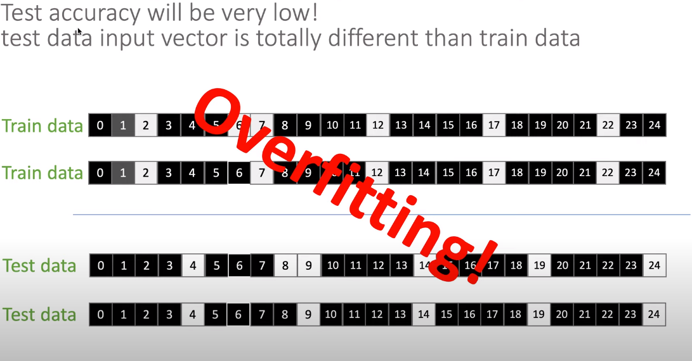
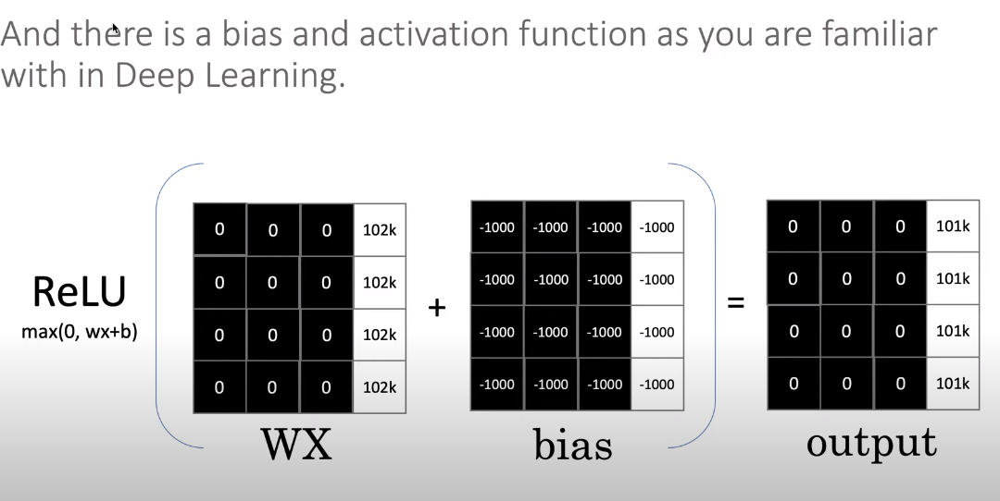
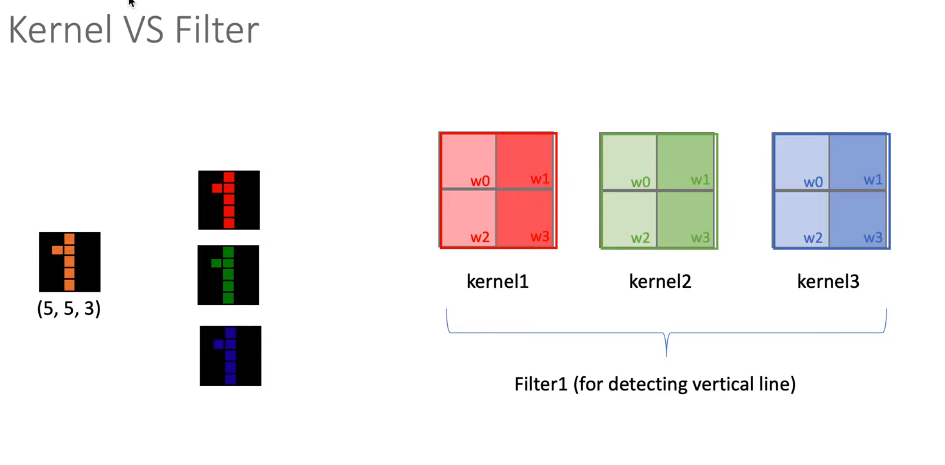
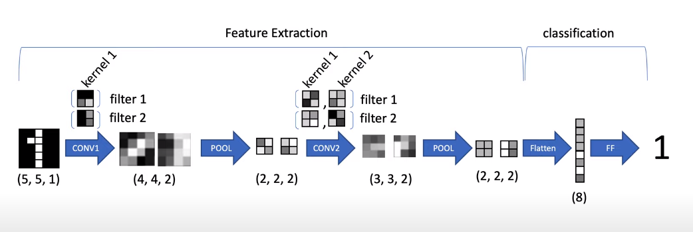

## CNN 실습

- https://www.youtube.com/watch?v=3exMAKtSGBQ

- https://github.com/minsuk-heo/tf2/blob/master/jupyter_notebooks/07.CNN.ipynb

- MLP 

  - Multi Layer Perceptron

  - 딥러닝 모델

  - dense layer 결합

  - 기초적이고 단순 But, 이미지 분류에서의 큰 단점

  - 

    - 행과 열이 있는 2차원 데이터를 1차원 데이터로 변경하는 과정을 가장 먼저 수행

    - 1차원 데이터여야 dense layer의 입력으로 들어감

    - 위의 예시 사진처럼 학습정확도는 높으나 테스트 정확도는 낮음

      (2, 7, 12,... 픽셀 모두 검은색으로 학습 데이터의 패턴이 하나도 없음)

    - 학습은 잘 되었는데 테스트 결과는 엉망.. 

    - CNN 등장!

- 2x2 Kernel을 옮겨가며 수직선, 수평선 확인

  - 255 가까울 수록 흰색, 0에 가까울수록 검정
  - kernel 픽셀 색에 따라 숫자 달리해줌
  - 곱해서 더하고 하나의 픽셀로 계산
  - 완성된 feature map (after Conv layer)
  - 

- Kernel vs. Filter

  - Filter - 하나의 특징을 찾기 위한 목적을 지님 ex. 수직 특징, 수평 특징
  - Kernel - 2차원 행렬, 이미지 위에서 돌아다님
  - 
  - 컬러 이미지는 실제로 R, G, B의 이미지가 겹쳐진 것
    - CNN의 입력값으로 들어올 경우, 실제로는 세 장이 이미지가 입력되는 것임

- 예제

  - 
  - convolution 진행하다보니 feature map의 크기가 줄어듬, 커널이 이동하기 힘듬 -> zero padding 사용!
  - MLP는 모든 픽셀을 특징으로 사용, CNN은 발견된 생김새 정보를 특징으로 함