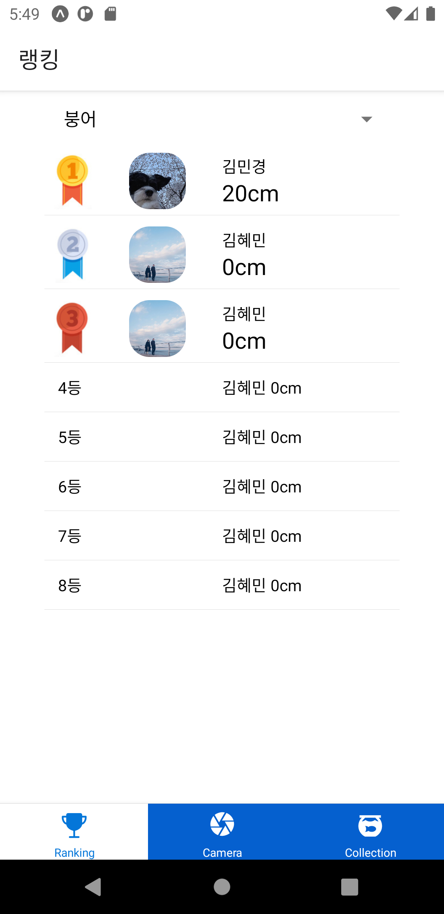
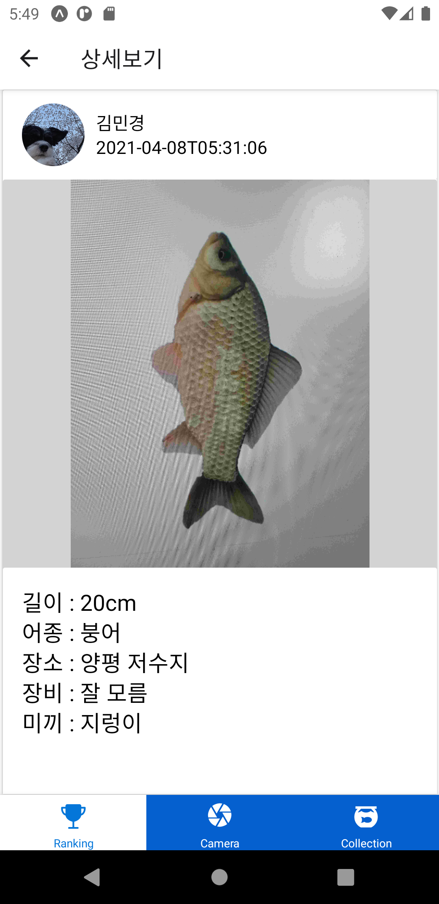
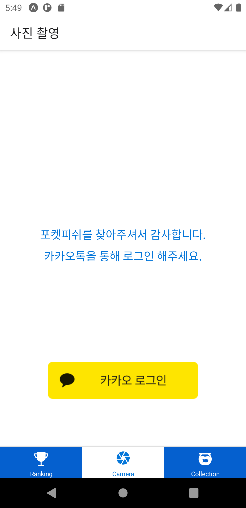
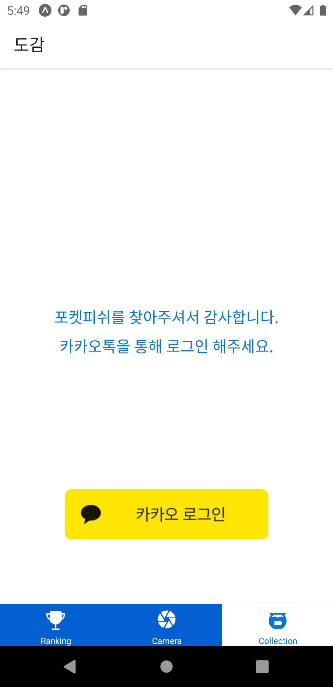
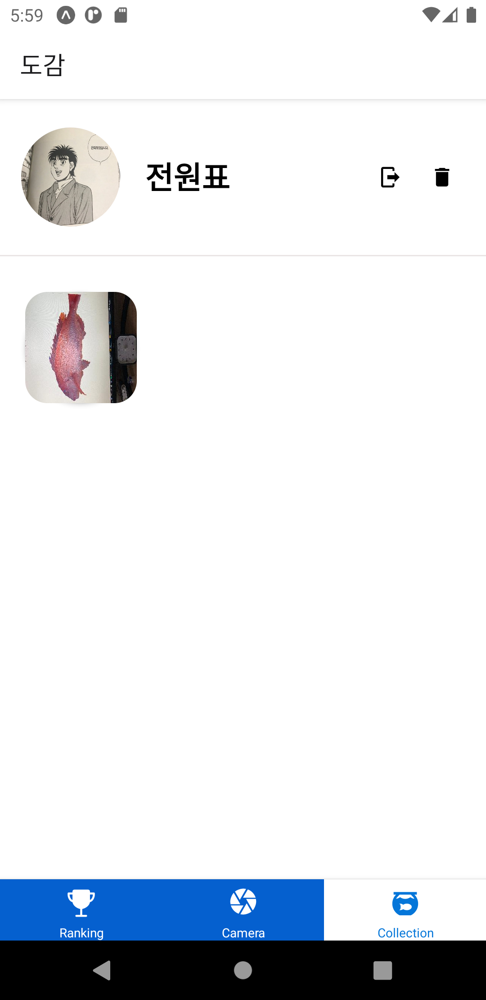
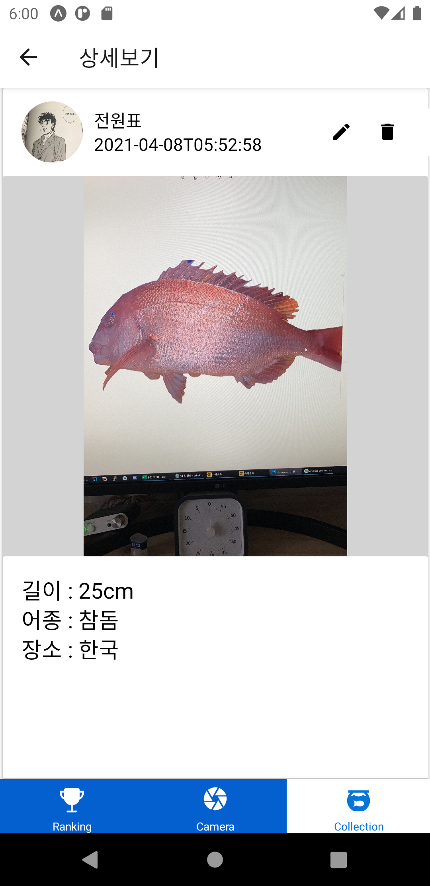

## 랭킹

어플 실행 후 나오는 첫 화면으로 Top3 랭커의 경우 프로필과 함께 상단에 고정 표시되며 나머지 인원들은 스크롤 뷰를 통해 닉네임과 기록이 표시됩니다.

랭킹 유저를 터치하면 해당 유저가 잡은 물고기 상세 정보를 확인할 수 있습니다.

## 카메라 분석

카메라 분석 기능을 위해서는 카카오 로그인이 필요합니다.

로그인 후, 잡은 물고기를 촬영할 수 있습니다.

촬영 후 사진 결과를 보고 분석을 요청합니다.

서버와 통신하여 분석 결과를 받아올 수 있습니다.

저장하기를 통해 세부 내용을 입력하고 도감에 저장할 수 있습니다.

저장된 물고기는 나의 도감 스크린에서 확인할 수 있습니다.

## 콜렉션

개인 도감 기능을 사용하기 위해서는 카카오 로그인이 필요합니다.

로그인을 하게 되면 상단에 닉네임과 로그아웃, 회원탈퇴와 같은 간단한 프로필 정보가 표시되며, 하단에서 저장했던 물고기 기록을 확인할 수 있습니다.

도감 사진을 터치하면 상세 페이지로 이동하여 해당 정보를 확인할 수 있으며, 수정 및 삭제 기능을 제공합니다.

