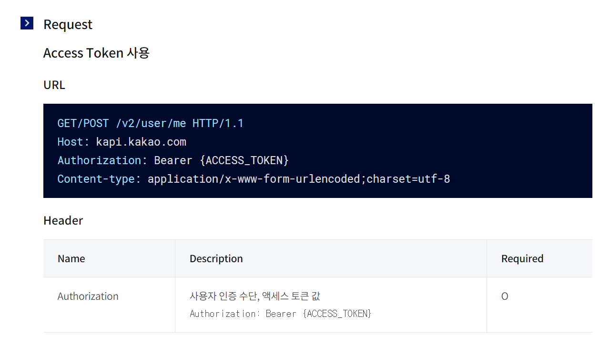

## 카카오 로그인 진행현황

### 1. 인가 코드 받기

- [x] App 로그인 API 호출

### 2. Redirect URL

- [x] App에서 로그인 후, 인가 코드를 아래와 같은 형식으로 요청

  GET https://j4a202.p.ssafy.io/auth/login?code={authorization_code}

- [ ] 위의 요청을 받으면 같이 카카오 인증 서버에 요청하여 토큰 발급하여 App에 응답 필요

  POST https://kauth.kakao.com/oauth/token

### 3. 유저 정보

- [ ] 위에서 발급 받은 엑세스 토큰을 통해 회원 정보 확인 가능

  GET/POST https://kapi.kakao.com/v2/user/me

