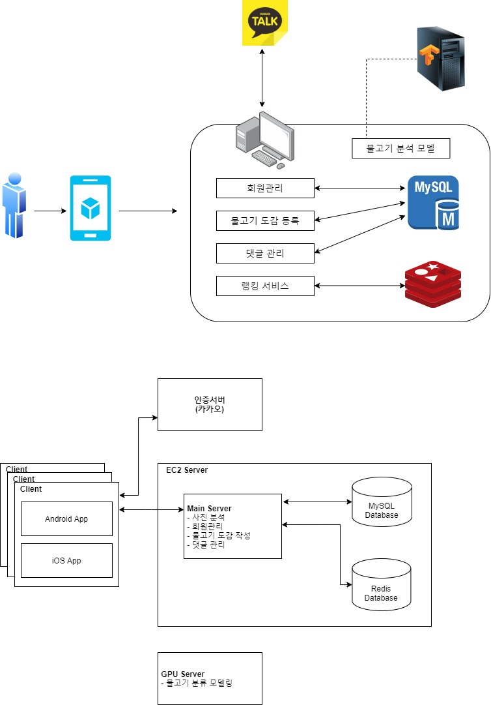
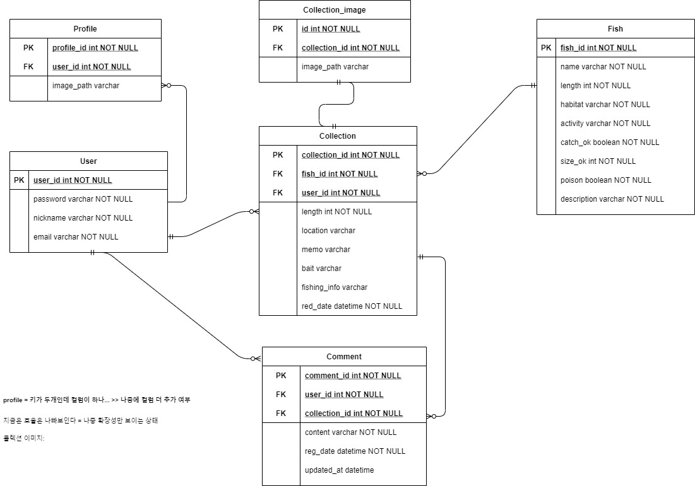
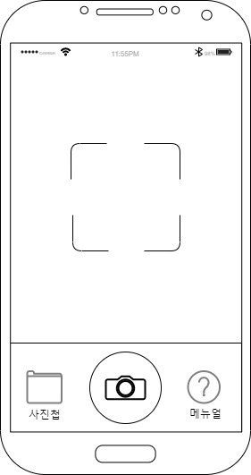

# 0319 발표

- #### 아키텍처

- #### 시퀀스 다이어그램

  - ##### 인증

  

  - ##### 분석

  

- #### ERD

  - 자주 update이 되는 부분 세부 정규화

- #### 와이어프레임

  - 회원가입 

    - 소셜 로그인 확정 : 카카오

    

  - 로그인 

    - 소셜 로그인 대체 전 와이어프레임

    

  - 회원 정보

    

  - 물고기 보관함

    - 사진, 메모, 내용이 간략히 들어감

    

  - 물고기 상세보기

    - User 입장

      

    - Others 입장 

      

  - 카메라

    - 글을 등록하기 위한 사진 촬영 과정

    

  - 물고기 등록

    - 글 작성 1

      

    - 글 작성 2

      

    - 글 작성 3

      

    - 글 작성 4

      

  - 랭킹

    - Top 1-3, Top 4-50 가 보여짐

    

  